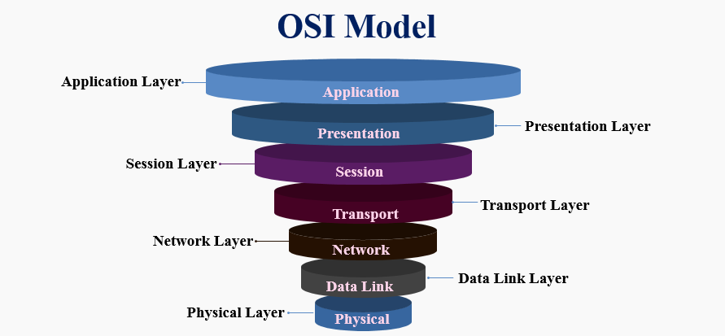
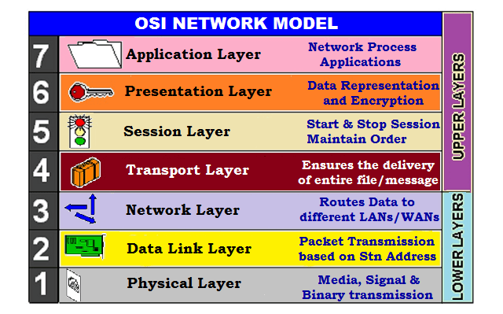

# OSI model

OSI stands for Open Systems Interconnection. As the name suggests, it is a standard for communications between computing systems. The goal of OSI model is to build a structure in which any device can connect to every device without affected by its internal working. In the 1970s, the concept of interconnection between to devices was very much accepted. But, countries like France, UK, Germany and US had developed their own kind of protocols. So, to standardize the communication, the OSI model was developed in the late 1970s and early 1980s. OSI model took some time to be accepted by everyone. But vwry slowly, every model of communication was transferred to OSI model. At present, almost all devices interchange data based on the protocols of OSI model.

OSI model characterizes the connection of any two devices among 7 layers of protocol. Every layer has a different functionality. So, the 7 layers are :-

## Physical layer :
>The physical layer is responsible for the transmission and reception of unstructured raw data between a device and a physical transmission medium. It converts the digital bits into electrical, radio, or optical signals. Layer specifies characteristics such as voltage levels, the timing of voltage changes, maximum transmission distances, modulation scheme, physical data rates, channel access method and physical connectors. This includes the layout of pins, voltages, line impedance, cable specifications, signal timing and frequency for wireless devices. Bit rate control is done at the physical layer and may define transmission mode as simplex, half duplex, and full duplex. The components of a physical layer can be described in terms of a network topology. Physical layer specifications are included in the specifications for the ubiquitous Bluetooth, Ethernet, and USB standards.

## Data-Link layer :
>The data link layer provides device-to-device data transfer—a link between two directly connected devices. A device may also be called as a node. It detects and possibly corrects errors that may occur in the physical layer. It defines the protocol to connect, transmission of data and to terminate a connection between two physically connected devices. There are two sublayers of data-link layer :- 
>
>1. Medium access control (MAC) layer – responsible for controlling how devices in a network gain access to a medium and permission to transmit data.
>
>2. Logical link control (LLC) layer – responsible for identifying and encapsulating network layer protocols, and controls error checking and frame synchronization.
>
>The Point-to-Point Protocol (PPP) is a data link layer protocol that can operate over several different physical layers, such as synchronous and asynchronous serial lines.

## Network later :

>The network layer provides the functional and procedural means of transferring packets from one node to another connected in "different networks". A network is a medium to which many nodes can be connected, on which every node has an address and which permits nodes connected to it to transfer messages to other nodes connected to it by merely providing the content of a message and the address of the destination node and letting the network find the way to deliver the message to the destination node, possibly routing it through intermediate nodes. If the message is too large to be transmitted from one node to another on the data link layer between those nodes, the network may implement message delivery by splitting the message into several fragments at one node, sending the fragments independently, and reassembling the fragments at another node. It may, but does not need to, report delivery errors.
>
>Message delivery at the network layer is not necessarily guaranteed to be reliable; a network layer protocol may provide reliable message delivery, but it need not do so.

## Transport layer :

>The transport layer provides the functional and procedural means of transferring variable-length data sequences from a source to a destination host, while maintaining the quality of service functions.
>
>The transport layer controls the reliability of a given link through flow control, segmentation/desegmentation, and error control. Some protocols are state- and connection-oriented. This means that the transport layer can keep track of the segments and retransmit those that fail delivery. The transport layer also provides the acknowledgement of the successful data transmission and sends the next data if no errors occurred. The transport layer creates segments out of the message received from the application layer. Segmentation is the process of dividing a long message into smaller messages.
>
>OSI defines five classes of connection-mode transport protocols ranging from class 0 (which is also known as TP0 and provides the fewest features) to class 4 (TP4, designed for less reliable networks, similar to the Internet). Class 0 contains no error recovery and was designed for use on network layers that provide error-free connections. Class 4 is closest to TCP, although TCP contains functions, such as the graceful close, which OSI assigns to the session layer. Also, all OSI TP connection-mode protocol classes provide expedited data and preservation of record boundaries.

## Session layer
>The session layer controls the dialogues (connections) between computers. It establishes, manages and terminates the connections between the local and remote application. It provides for full-duplex, half-duplex, or simplex operation, and establishes procedures for checkpointing, suspending, restarting, and terminating a session. In the OSI model, this layer is responsible for gracefully closing a session. This layer is also responsible for session checkpointing and recovery, which is not usually used in the Internet Protocol Suite. The session layer is commonly implemented explicitly in application environments that use remote procedure calls.
>
>In the modern TCP/IP system, the session is non-existent and simply part of the TCP protocol.

## Presentation layer
>The presentation layer establishes context between application-layer entities, in which the application-layer entities may use different syntax and semantics if the presentation service provides a mapping between them. If a mapping is available, presentation protocol data units are encapsulated into session protocol data units and passed down the protocol stack.
>
>This layer provides independence from data representation by translating between application and network formats. The presentation layer transforms data into the form that the application accepts. This layer formats data to be sent across a network. It is sometimes called the syntax layer. The presentation layer can include compression functions. The Presentation Layer negotiates the Transfer Syntax.

## Application layer :

>The application layer is the OSI layer closest to the end user, which means both the OSI application layer and the user interact directly with the software application. This layer interacts with software applications that implement a communicating component. Such application programs fall outside the scope of the OSI model. Application-layer functions typically include identifying communication partners, determining resource availability, and synchronizing communication. When identifying communication partners, the application layer determines the identity and availability of communication partners for an application with data to transmit. The most important distinction in the application layer is the distinction between the application-entity and the application. For example, a reservation website might have two application-entities: one using HTTP to communicate with its users, and one for a remote database protocol to record reservations. Neither of these protocols have anything to do with reservations. That logic is in the application itself. The application layer has no means to determine the availability of resources in the network.

## Summary :
>I will summarize the above dicussed topics with an image of OSi model.
>
>

## References :
1. [Wikipedia/osi-layer](https://en.wikipedia.org/wiki/OSI_model)
2. [Geeksforgeeks/osi-layer](https://www.geeksforgeeks.org/layers-of-osi-model/)